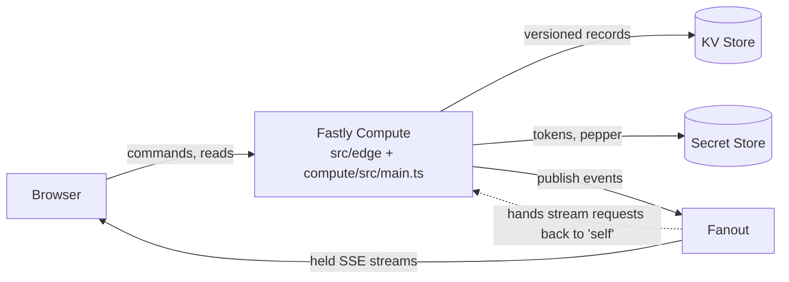

# Architecture

EdgeCanvas is one TypeScript code base. The same game rules run in the browser (to predict your own moves), in the
hosted service on Fastly Compute (the authority) and in a small local Node server (for development). This document
describes the hosted design, which is the one that matters.

## Code map

| Path | Responsibility |
|---|---|
| `src/game/` | Pure game logic: commands and the engine (`engine.ts`), prices (`rules.ts`, the `COST` table), target geometry and exact paint cost (`targets.ts`), day results and the champion (`standings.ts`). No I/O. |
| `src/data/steps.ts` | Validates the steps CSV and produces the dataset. |
| `src/edge/app.ts` | The whole HTTP API as a Fetch-API handler, so it runs unchanged on Compute and in Node tests. |
| `src/edge/authority.ts` | The room authority on KV: tiles, wallets, the clock, scheduled days, previews. |
| `src/edge/accounts.ts`, `passwords.ts` | Invite-only accounts, sessions, recovery, WebCrypto password hashing. |
| `src/edge/throttle.ts` | Rate limiter kept in KV, so limits are global rather than per location. |
| `src/edge/grip.ts`, `ink-ticket.ts` | Fanout: Grip-Sig verification, hold headers, publishing; signed tickets for drawing previews. |
| `src/edge/kv.ts` | The KV interface and an in-memory implementation used by tests. |
| `src/rooms/edge-client.ts` | Browser client for hosted rooms: command queue, prediction, per-tile merging, the Fanout stream. |
| `src/ui/` | The interface: canvas renderer, pointer input, scoreboard, animations. |
| `compute/` | The Compute service: `src/main.ts` adapts Fastly's KV, Secret Store and Fanout APIs to `src/edge`; `scripts/` provisions and runs it. |
| `server/` | A local Node server (SQLite) for development and the organizer command line (`edge-admin.ts`). |
| `tests/` | Rules, storage protocol, HTTP, clients and the interface logic. |

## Storage model

KV has no transactions and reads are eventually consistent, so every authoritative record is a **write-once,
versioned key** created with insert-if-absent (`add`). Writers race for the next version number; the loser sees its
insert refused and retries on the newer version. Contention is split the way the game is:

| Key | Record | Written by |
|---|---|---|
| `r/<room>/meta` | Room definition and the private step histories (immutable) | the organizer |
| `r/<room>/t/<tile>/<n>` | One of 100 tiles of 10 × 10 pixels: owners, shields, and the commands already applied | painters of that tile |
| `r/<room>/w/<player>/<n>` | A player's wallet: spent paint, inventory, receipts, a pending plan | that player only |
| `r/<room>/c/<n>` | The shared clock: simulated minute, optional daily schedule, results of closed days | the host, or the first request after a scheduled change |
| `a/…`, `usr-…` | Accounts, sessions, enrollment and recovery codes | account routes |
| `t/…` | Rate-limit slots (they expire on their own) | any request |

A player's balance is derived (`earned − spent`, earned computed from the clock), so advancing a day writes one key.

### A paint command

1. **Reserve.** Write a new wallet version holding the full price and the plan (which cells, tile by tile).
2. **Apply.** Write each affected tile version; every tile records `player:commandId`, so re-applying is a no-op.
3. **Finalize.** Write a wallet version that refunds anything a racing player made unpaintable.

A request that dies between steps is finished by the same player's next request, and a retry with the same command ID
returns the original receipt, so nothing is charged twice. Trade-offs: under races a stamp can apply to only part of its
area, and rejected commands are not stored.

## Time, days and scoring

The clock is the only source of credits and shield expiry. The host advances it by hand, or turns on a daily schedule:
the schedule lives in the clock record and is applied by whichever request first notices it is due (no timer needed;
days that passed unnoticed are caught up, never beyond the last recorded day). When a day closes, the leader (most
pixels, strictly) is stored in the clock record, which is what the scoreboard and the champion (most days won) use.

## Real time

Browsers hold a Server-Sent Events stream. Compute answers `/api/rooms/<code>/events` with a GRIP `hold` after
authorizing the session, and Fanout keeps the connection open (Fanout calls the service back as `self`, signed with
Grip-Sig). Compute publishes to Fanout through Fastly's API with a token kept in the Secret Store. Events on a room's
channel: `tile` (new tile version), `clock`, `roster`, `fx` (bomb or shield effects) and `ink` (a drawing preview).

Saving a stroke takes a second or two of KV round trips, so drawing is layered:

- **Your screen:** the move is predicted locally and shown at once; the prediction is fixed when the move is made, so
  the paint counter can never be charged twice.
- **Other screens, fast:** the browser sends previews (`ink`) one request at a time, in drawing order. Compute checks a
  short-lived HMAC ticket (no account or storage lookups), publishes the pixels to Fanout, and other browsers show them
  as provisional "ghosts" for up to 10 seconds.
- **Other screens, saved:** the tile events replace the ghosts. A stale snapshot never rolls back a newer tile or wallet.

## Accounts and safety

Accounts are invite-only: a one-time code is tied to one roster player. Passwords are PBKDF2-HMAC-SHA256 built from
WebCrypto HMAC (Compute has no native PBKDF2), keyed with a pepper from the Secret Store. Sessions are HttpOnly
cookies with CSRF tokens; each player has request budgets kept in KV. The limits are tabulated in [GUIDE.md](GUIDE.md).

## Running it locally

- `npm test` runs everything against in-memory KV; `MemoryKV` can inject latency and stale reads.
- `compute/` can run on Viceroy with a local Pushpin standing in for Fanout (`compute/scripts/local-pushpin.sh`).
- Some behavior only shows on the real platform (for example KV `list` prefixes may not contain `/` or `:`, and
  insert conflicts surface as "Precondition failed"); [GUIDE.md](GUIDE.md) lists what was found.
